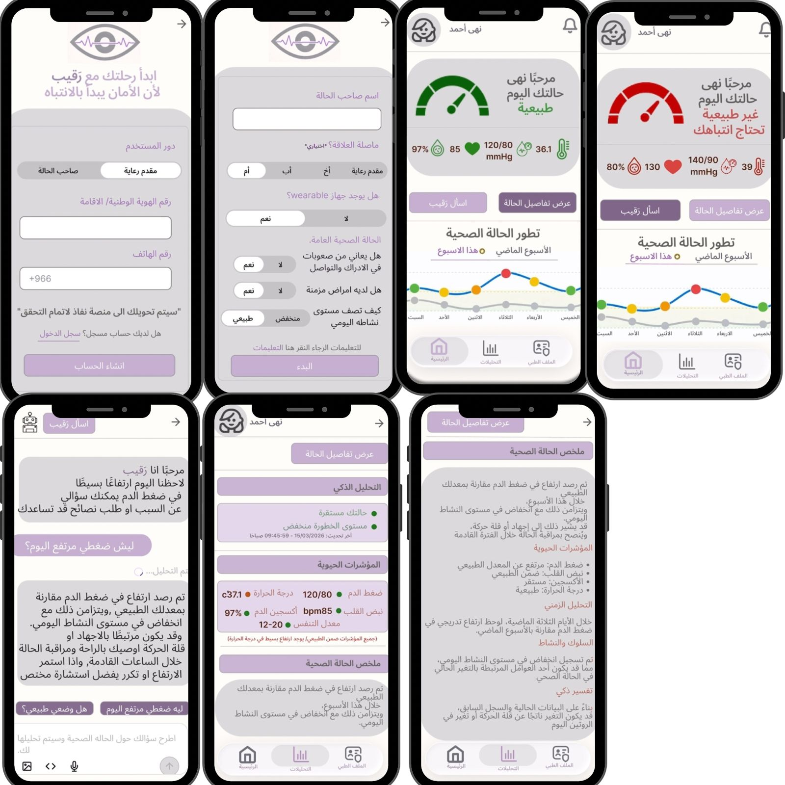
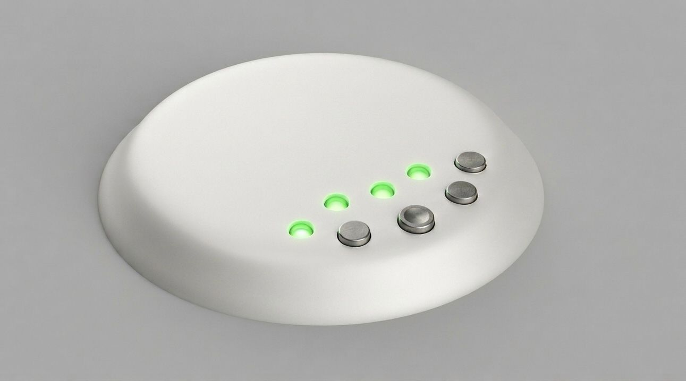
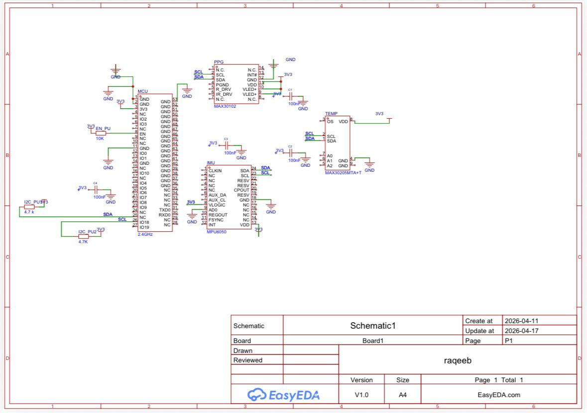

# رَقيب

### نظام ذكي لمراقبة التغييرات الصحية لذوي الإعاقات الإدراكية وصعوبات التواصل

---

## مقدمة عن المشروع

يواجه الأشخاص ذوو الإعاقات الإدراكية وصعوبات التواصل تحدياً كبيراً في التعبير عن شعورهم بالألم أو شرح الأعراض الجسدية التي يمرون بها. هذا العجز عن التواصل غالباً ما يؤدي إلى تأخر في اكتشاف المشاكل الصحية وتدهور الحالة قبل ملاحظتها، مما يشكل خطراً كبيراً على سلامتهم ويضع عبئاً ثقيلاً على مقدمي الرعاية في محاولة التنبؤ بحالتهم الصحية.

يأتي مشروع **رقيب** ليكون جسراً لهذا التواصل المفقود؛ حيث يعمل النظام عبر جهاز قابل للارتداء على مراقبة المؤشرات الحيوية بشكل لحظي ومستمر. القيمة الحقيقية للمشروع تكمن في قدرته على تحويل البيانات الحيوية المعقدة إلى معلومات مفهومة وتنبيهات استباقية، مما يمنح هذه الفئة وسيلة رقمية للتعبير عن احتياجاتهم الصحية وتوفير بيئة رعاية أكثر أماناً واستجابة.

---

## واجهات المستخدم (UI/UX)
توضح الصور التالية واجهات تطبيق "رقيب" وتجربة المستخدم:

<p align="center">
<p align="center">  </p>
</p>

---

## الجانب الهندسي وتصميم الجهاز

### التصميم الخارجي للجهاز (CAD Design)
<p align="center">
  
</p>

### مخطط توصيل الحساسات (Circuit Diagram)
*يوضح المخطط التالي كيفية ربط الحساسات المختلفة (مثل ESP32, MAX30102، وغيرها) ببعضها البعض:*

<p align="center">
<p align="center">  </p></p>
</p>

---

## التقنيات المستخدمة
* Python
* streamlit
* LLM (تحليل الحالة)
* NLP (فهم النتائج)
* Text-to-Speech (TTS)
* API Integration

---

## التشغيل
```bash
pip install streamlit requests
streamlit run raqeb_app.py
